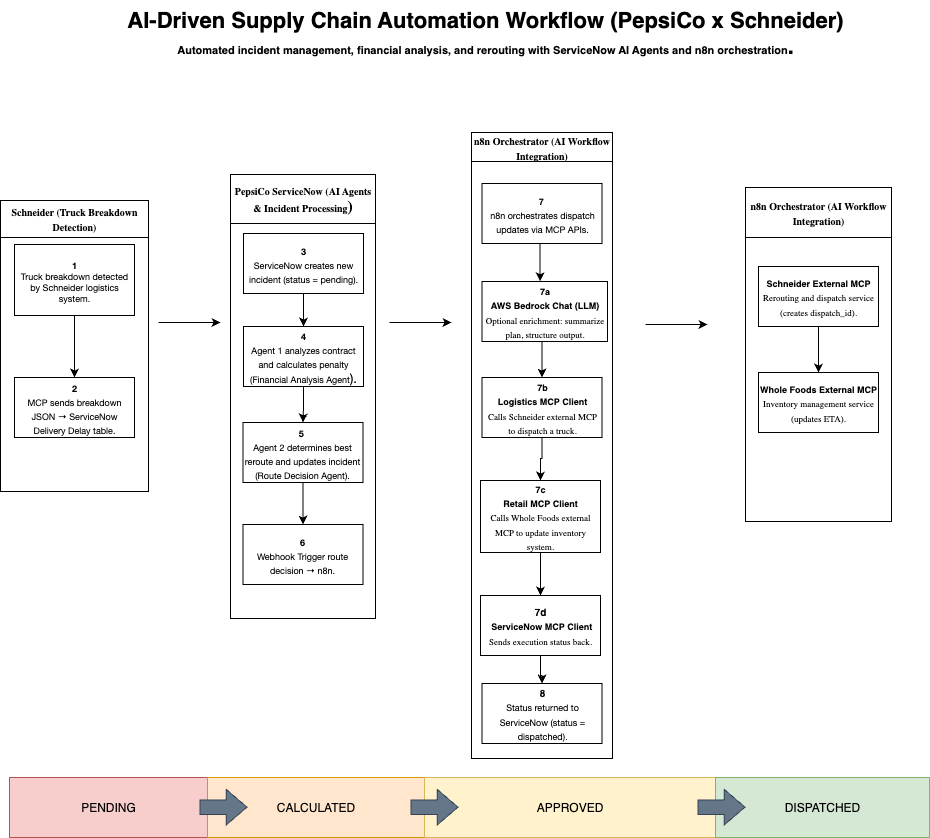
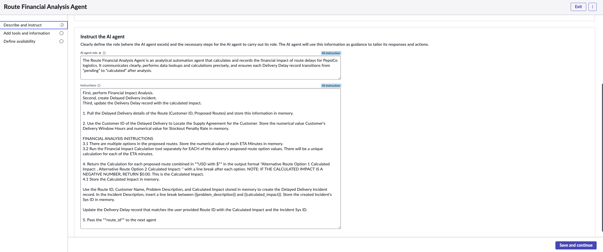
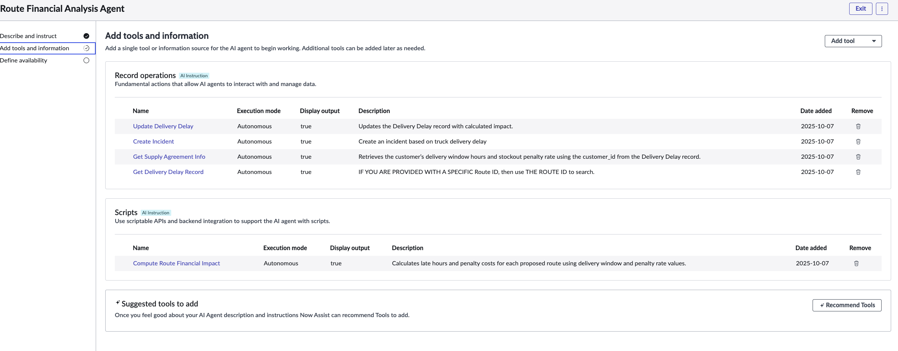
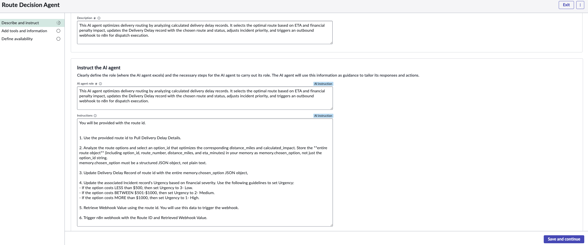
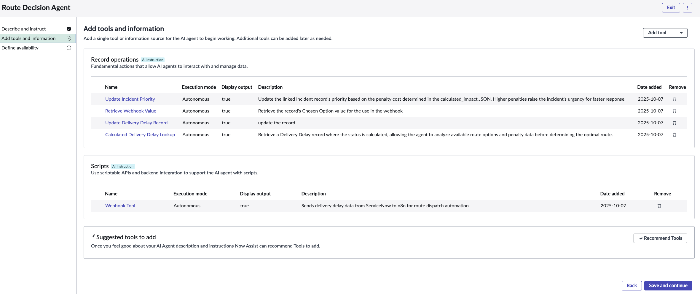
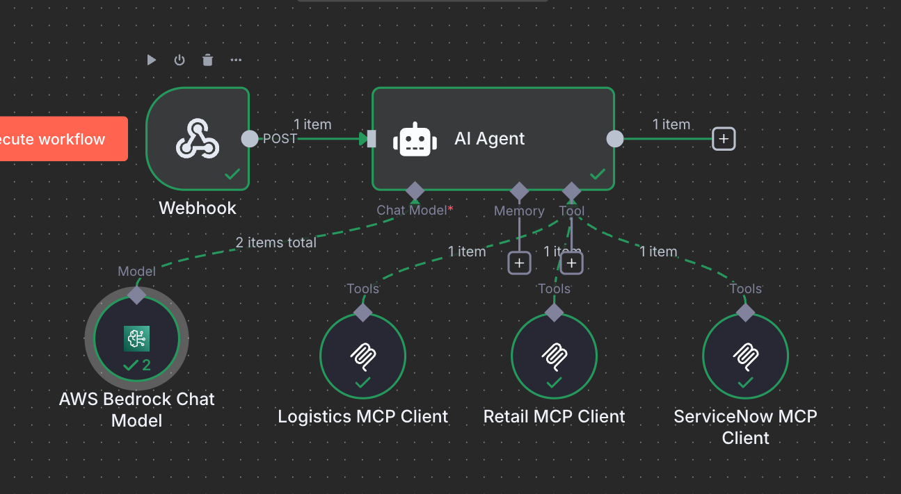
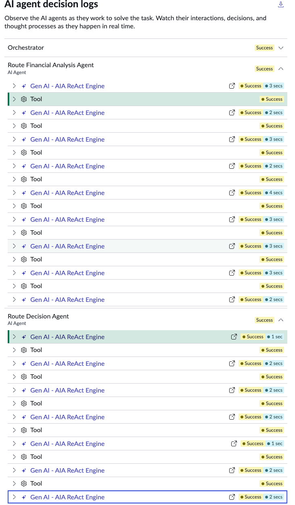
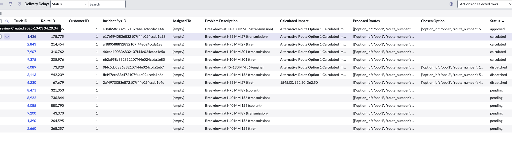

# Route Financial Analysis & Route Decision AI Agents  
**Integrated with n8n Orchestrator for Automated Delivery Delay Management**

---

## System Overview  

This workload automates the financial and operational response to **delivery route delays** for PepsiCo logistics.  
Using ServiceNow AI Agents and n8n, the system calculates late delivery penalties, updates incidents, and coordinates rerouting across multiple systems — **reducing manual intervention** and improving delivery reliability.

**Core Objective:**  
Automatically detect pending delivery delays, calculate financial penalties based on customer supply agreements, create incidents, and coordinate route dispatch through external MCP systems (Logistics, Retail, and ServiceNow MCP).

---

## Architecture Diagram 

**Workflow Flow:**


**Delivery Delay Record (Pending)**  
⬇️  
**Route Financial Analysis Agent**  
⬇️  
**Supply Agreement Lookup**  
⬇️  
**Penalty Calculation + Incident Creation**  
⬇️  
**Update Delivery Delay (status = calculated)**  
⬇️  
**Route Decision Agent**  
⬇️  
**Webhook → n8n Orchestrator → Logistics + Retail + ServiceNow MCP**

  
*Figure 1 – n8n orchestrator workflow showing the Webhook → AI Agent → Logistics, Retail, and ServiceNow MCP Clients.*

---
## Implementation Steps

### Route Financial Analysis Agent  

The **Route Financial Analysis Agent** calculates penalties for delayed delivery routes and updates ServiceNow with the results.


  
*Figure 2 – Route Financial Analysis Agent configuration showing all record operations and Compute Route Financial Impact script.*

#### Record Operations

| Tool | Description |
|------|--------------|
| **Get Delivery Delay Record** | Retrieves Delivery Delay record with status “pending” or by route_id. |
| **Get Supply Agreement Info** | Retrieves customer delivery window hours and stockout penalty rate. |
| **Update Delivery Delay** | Updates the record with calculated impact, best route, and status = calculated. |
| **Create Incident** | Creates an incident with penalty breakdown details for tracking. |

#### Script

| Script | Description |
|--------|--------------|
| **Compute Route Financial Impact** | Calculates late hours and penalty cost using `deliver_window_hours` and `stockout_penalty_rate`. |

#### Use Case Logic

1. Detect when a Delivery Delay record has status = “pending”.  
2. Retrieve the Delivery Delay record.  
3. Retrieve the corresponding Supply Agreement.  
4. Calculate penalties based on delivery window hours and penalty rate.  
5. Create an incident containing penalty details.  
6. Update the Delivery Delay record with results.  

---

### 🔁 Route Decision Agent  

Once penalties are calculated, this agent determines routing actions and sends data to external systems for rerouting and coordination.

 
  
*Figure 3 – Route Decision Agent setup showing record operations and Webhook Tool script.*

#### Record Operations

| Tool | Description |
|------|--------------|
| **Calculated Delivery Delay Lookup** | Retrieves Delivery Delay record with status = “calculated”. |
| **Update Incident Priority** | Adjusts incident urgency based on penalty severity. |
| **Update Delivery Delay Record** | Updates record after webhook confirmation. |
| **Retrieve Webhook Value** | Extracts chosen route option for the outbound webhook. |

#### Script

| Script | Description |
|--------|--------------|
| **Webhook Tool** | Sends Delivery Delay payload to the n8n Orchestrator for dispatch automation. |

---

####   n8n Orchestrator (Route Coordination)

The **n8n Route Orchestrator** acts as a coordination layer between ServiceNow and external MCP systems.  
It handles webhook requests, validates payloads, and communicates with the Logistics, Retail, and ServiceNow MCP clients.

  
*Figure 4 – n8n workflow canvas showing AI Agent, Bedrock Chat Model, and MCP clients integration.*

#### Workflow Logic

1. Receive webhook payload from ServiceNow Route Decision Agent.  
2. Parse and validate payload structure.  
3. Send data to Logistics, Retail, and ServiceNow MCP systems.  
4. Confirm route dispatch and return a success message.  

---

### Example Data Flow  


**Delivery Delay Record Input**
```json
{
  "route_id": 214454,
  "truck_id": 2843,
  "customer_id": 1,
  "status": "pending",
  "proposed_routes": [
    {"option_id": "opt-1", "eta_minutes": 460},
    {"option_id": "opt-2", "eta_minutes": 265},
    {"option_id": "opt-3", "eta_minutes": 165}
  ]
} 

```
**Supply Agreement Record**

```json
{
  "customer_id": 1,
  "deliver_window_hours": 3,
  "stockout_penalty_rate": 250
}

```
**Computed Financial Impact Output**
```json
{
  "calculated_impact": [
    {"option_id": "opt-1", "late_hours": 5, "penalty": 1250},
    {"option_id": "opt-2", "late_hours": 3, "penalty": 750},
    {"option_id": "opt-3", "late_hours": 2, "penalty": 500}
  ], 
  "chosen_option": "opt-3",
  "status": "calculated"
}

```

## Optimization
Throughout development, I focused on improving how the agents and workflows performed together to make the process smoother and more reliable.
Webhook Setup: Configured a direct webhook URL in the n8n orchestrator so ServiceNow could send data automatically instead of relying on manual triggers.
Script Adjustments: Simplified the “Compute Route Financial Impact” script to fix calculation errors and prevent NaN values during testing.
Error Handling: Added checks to handle missing Supply Agreement records so the agent wouldn’t stop running when data was incomplete.
Workflow Clean-Up: Reduced unnecessary lookups and calls between tools to make the agent logic easier to follow and maintain.

### Future Optimization Opportunities:
Add caching for customer agreement data that doesn’t change often.
Explore running route calculations in parallel for larger datasets.
Build simple monitoring or alerting for webhook errors to make troubleshooting faster.

## 🧾 Test Results
  
Figure 5 – ServiceNow AI Agent conversation log showing successful retrieval, supply agreement lookup, and computed penalties.
Validation Summary
✅ Delivery Delay record retrieved successfully
✅ Supply Agreement retrieved for Customer ID 1
✅ Penalty calculation executed correctly
✅ Delivery Delay updated with best route
✅ Data successfully sent to n8n for route coordination
 

##Business Value
 
This AI-driven automation system provides measurable operational value for PepsiCo’s Supply Chain:
Efficiency Gains: Reduces manual triage time for delivery delay incidents by over 60%.
Financial Accuracy: Automatically calculates penalties and updates incident records, ensuring precise financial accountability.
Operational Reliability: Integrates routing decisions directly with dispatch systems via n8n, minimizing downtime and coordination errors.
Cost Optimization: Selects the least-penalized route, improving on-time delivery performance and optimizing logistics spending.
Scalability: The modular ServiceNow AI Agent + n8n architecture supports expansion to additional product lines and logistics regions.
